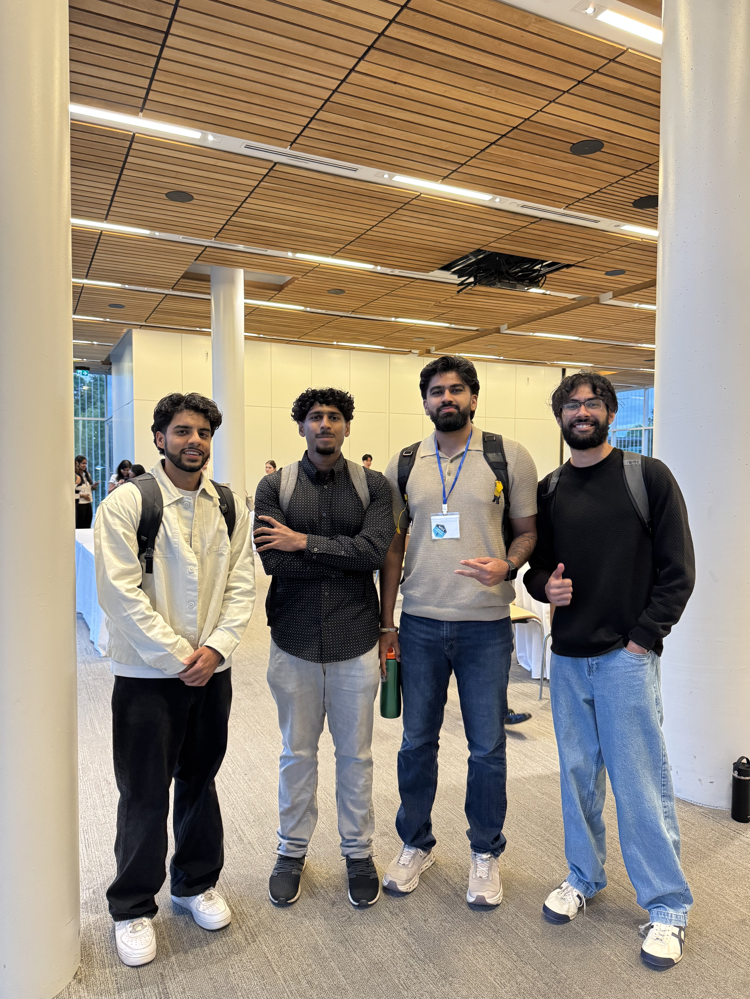

My first week of MDS has definitely been a busy one. 
There has been a lot of adjustment compared with the first week of my undergraduate degree. 
The emails leading up to the program and orientation really emphasized how intensive MDS would be, but it was still jarring to experience it firsthand. 
The first week of classes has been great so far, and the program has many professors who genuinely want students to succeed. 
I have also made many new friends who come from diverse backgrounds and have very different experiences from me, 
which I think will bring a lot of unique perspectives to the program. I'm looking forward to getting to know everyone better.

Although it was expected, the biggest surprise so far has been the pace. 
In undergrad, I was used to having a week to settle into the course load and then working at a relatively comfortable pace for the rest of the term. 
In MDS, the pace picks up right from the start. There is a lot of material covered every day and many submissions due each week. 
If you miss anything, whether it is a lecture or a lab, the work can pile up quickly. 
Another thing that surprised me is how often we context switch. One lecture we might be learning Python for data science, and the next we are diving into R or statistics.

So far, I am enjoying the program as I get used to the intense schedule and fast-paced environment. 
I am also looking forward to creating new projects, learning new skills, and getting to know everyone better.

